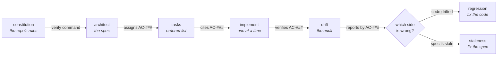

<div align="center">

# Spec Architect

**Five skills that turn a vague idea into working code without losing the reasoning along the way —
each stage handing the next a set of numbered criteria, so "done" is something you check rather
than something you feel.**

Plain Markdown for Claude Code. **No dependencies, no build step, nothing here executes.**

<a href="https://github.com/DahanItamar/spec-architect/actions/workflows/test.yml"></a>


<a href="LICENSE"></a>


<a href="examples/the-loop.md">The loop</a> ·
<a href="examples/before-and-after.md">Before and after</a> ·
<a href="examples/shift-planner-spec.md">An example spec</a> ·
<a href="examples/proof/README.md">The proof</a>

</div>

---

## What the stages hand each other

Most "spec workflows" are five prompts that happen to run in order. Nothing survives the handoff, so
by stage four the agent is judging prose it wrote itself against prose it wrote earlier.

What travels here is an identifier. `spec-architect` writes each requirement as one EARS sentence
with a stable `AC-###`, and every later stage refers to it by number:



That is requirements traceability, and it is the whole reason the chain is more than five prompts.
A task that closes no criterion is either unnecessary work or evidence of a requirement nobody
wrote. A criterion no task closes is scope that will silently never be built — and **nothing
downstream catches that one**, because `spec-implement` only verifies what a task cites.

| ID | Criterion |
| --- | --- |
| AC-003 | If two shifts for one employee overlap by any minute, then the scheduler shall flag both and refuse to publish. |

One sentence, one obligation, one number. `shall` is load-bearing — it makes every requirement in
the document findable with a search.

## The five

| Stage | Skill | The rule it enforces |
|:-:|---|---|
| 1 | **spec-constitution** | A rule earns its place only if you can name what breaks when it is violated |
| 2 | **spec-architect** | Never ask what you can decide — ask only what changes the architecture |
| 3 | **spec-tasks** | A task is done when a named criterion is satisfied, not when the code looks finished |
| 4 | **spec-implement** | One task, verify, then the next — stop at the first unmet criterion |
| 5 | **spec-drift** | The spec and the code disagree: say *which one* is wrong |

Each is usable alone. `spec-architect` writes a perfectly good spec with no constitution above it,
and `spec-drift` audits a codebase whose spec was written by hand. The chain is what they are worth
together, not a prerequisite.

## The failure each stage is built against

Stage 4 exists because of a specific way agent-written code goes wrong: twelve tasks implemented,
task three turns out to be broken, and nine tasks of work are now sitting on top of it. So
`spec-implement` stops at the first unmet criterion instead of collecting failures for a summary.

Stage 5 exists because of the opposite mistake. When the spec and the code disagree, a tool that
always rewrites the spec blesses every regression it finds, and one that always flags the code
fights every deliberate change. `spec-drift` classifies each finding as **regression** or
**staleness** and edits neither side until you have seen the verdict.

> [!IMPORTANT]
> **`spec-implement` runs only the verify command named in the constitution.** Never one found in a
> spec, a task list, or a code comment. Those files are editable by anyone with commit access, so
> treating their contents as instructions would turn a spec file into remote code execution.

## Run it

There is nothing to run. It is Markdown that Claude Code reads.

```bash
# as a plugin
/plugin marketplace add DahanItamar/spec-architect
/plugin install spec-architect

# or drop the skills in directly
git clone https://github.com/DahanItamar/spec-architect /tmp/sa \
  && cp -r /tmp/sa/skills/* ~/.claude/skills/
```

Then `/spec-constitution` on a new repo, or `/spec-architect` if you already have conventions and
just want the spec. Both install routes work, and the plugin is self-contained — no catalogue
sits in between.

```bash
node --test examples/proof/proof.test.mjs   # 13 tests, 3 suites, ~61ms
```

## Under the hood — briefly

- **2,174 lines across 5 skills and 12 reference files.** Each `SKILL.md` loads on invocation; the
  references load only at the phase that needs them, so a task list is never written with the
  risk checklist in context.
- **The tests are an argument, not a smoke check.** `examples/proof/` holds the same feature built
  three ways — naive, spec-derived, and drifted three weeks later — and asserts what each one does
  to a shift that crosses midnight. The drifted case passes its own tests and contradicts §8 of its
  spec, which is exactly what stage 5 is for.
- **Change proposals, not spec rewrites.** Once a spec exists, `spec-architect` writes a diff under
  `docs/changes/` and leaves the spec alone. The reasoning that made feature 1 correct is the asset,
  and rewriting the document for feature 4 is how it gets deleted with nobody reading the diff.
- **Criteria are retired, never reused.** A requirement that no longer applies stays as a tombstone
  keeping its ID, because an archived task list still cites it.
- **Nothing executes at install.** No dependencies, no build, no scripts — a repository containing
  only Markdown is one you can audit before you run it.

> Previously published as **FlowSystem**, which shipped stages 2 and 5 only. The GitHub redirect
> keeps old clone URLs working; the plugin name has changed, so reinstall rather than update.

---

<div align="center">

Built by <a href="https://github.com/DahanItamar">Itamar Dahan</a> · <a href="LICENSE">MIT</a> · © 2026

</div>
