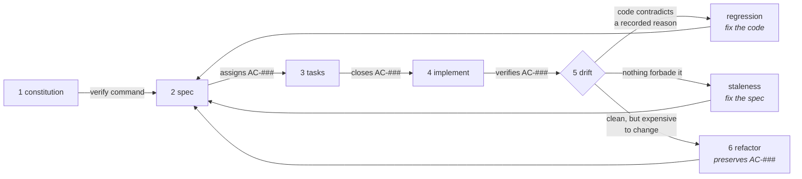

<div align="center">

# Spec Architect

**Six Claude Code skills that carry one identifier from a rough idea to shipped code — every
requirement gets a number in the spec, and every task, verification, audit and refactoring after it
cites that number.**

Plain Markdown, read by Claude Code.
**No `package.json`, no dependencies, no build step, nothing that executes at install.**

<a href="https://github.com/DahanItamar/spec-architect/actions/workflows/test.yml"></a>


<a href="LICENSE"></a>

<a href="examples/the-loop.md">The walkthrough</a> ·
<a href="examples/proof/README.md">The proof</a>

</div>

---

## The identifier that survives the handoff

Most spec workflows are a handful of prompts that run in order. Nothing travels between them, so by
the fourth prompt the agent is judging prose it wrote itself against prose it wrote earlier.

What travels here is an identifier. Stage 2 writes each requirement as one EARS sentence with a
stable `AC-###`, and no later stage may refer to a requirement any other way:

```text
docs/SPEC.md    AC-003  If two shifts for one employee overlap by any minute, then the
                        scheduler shall flag both and refuse to publish.

TASKS.md        - [ ] T-04 Detect overlaps on a minute timeline — closes AC-003

REFACTORINGS.md - [ ] R-02 Extract `toRange`, delete the two copies — preserves AC-003
```

`closes` in stage 3, `preserves` in stage 6 — one word apart, and the whole difference between
building a feature and restructuring one. A task that closes no criterion is either unnecessary
work or a requirement nobody wrote down.



| Stage | Command | Writes | The rule it enforces |
|:-:|---|---|---|
| 0 | `/spec-start` | nothing | Six commands in a picker give you no way to tell which one begins |
| 1 | `/spec-constitution` | `docs/CONSTITUTION.md` | A rule earns its place only if you can name what breaks when it is violated |
| 2 | `/spec-architect` | `docs/SPEC.md` | Never ask what you can decide — ask only what changes the architecture |
| 3 | `/spec-tasks` | `TASKS.md` | A task is done when a named criterion is satisfied, not when the code looks finished |
| 4 | `/spec-implement` | code | One task, verify, then the next — stop at the first unmet criterion |
| 5 | `/spec-drift` | a report | The spec and the code disagree: say *which one* is wrong |
| 6 | `/spec-refactor` | `docs/REFACTORINGS.md` | Restructure only what blocks scheduled work — and change no criterion doing it |

Stages 1 and 6 are optional and every stage runs alone. The last two audit different things: drift
asks whether the code does what the spec says, refactor asks whether code that already does can
still be changed cheaply. **A refactoring that needs an `AC-###` reworded is not a refactoring** —
it goes back to stage 2 as a change proposal.

## Run it

Requires **Claude Code**. Nothing is installed, compiled or executed.

```bash
# as a plugin
/plugin marketplace add DahanItamar/spec-architect
/plugin install spec-architect

# or drop the skills in directly
git clone https://github.com/DahanItamar/spec-architect /tmp/sa \
  && cp -r /tmp/sa/skills/* ~/.claude/skills/
```

Then run **`/spec-start`**. It reads the repository and names the one command to run next —
`/spec-constitution` on a new repo, `/spec-architect` if the conventions are settled,
`/spec-implement` if a task list is sitting there half-ticked.

> [!IMPORTANT]
> **The two stages that run shell commands — `/spec-implement` and `/spec-refactor` — run only
> the verify command named in `docs/CONSTITUTION.md`.** Never one found in a spec, a task list, a
> refactoring report or a code comment. Those files are editable by anyone with commit access, so
> treating their contents as instructions would turn a Markdown file into remote code execution.

## The proof

The one thing here that executes. No install — CI runs it on Node 22, output below is v24.15.0:

```bash
node --test examples/proof/proof.test.mjs
```

```text
▶ drifted — the code three weeks after the spec was written
  ✔ but the night shift can no longer be saved — §8 is contradicted (0.3713ms)
  ✔ and the rejection is silent: the overlap is simply never detected (0.1212ms)
▶ smelly — passes every criterion and is still unshippable
  ✔ behaves exactly like the spec-derived version — spec-drift finds nothing (0.2465ms)
  ✔ SM-002 Duplicate Code: the same day arithmetic, copied three times (0.0478ms)

ℹ tests 17
ℹ pass 17
ℹ fail 0
ℹ duration_ms 64.4798
```

Four lines of a 17-test run. The suite builds one shift-conflict feature four ways and asserts what
each does to a shift that crosses midnight:

| Version | Tests green | Matches the spec | Cheap to extend |
|---|:-:|:-:|:-:|
| `naive.mjs` — no spec, shapes chosen by convenience | ✅ | ❌ | ❌ |
| `spec-derived.mjs` — built against §5 and §8 | ✅ | ✅ | ✅ |
| `drifted.mjs` — three weeks and one sensible-looking fix later | ✅ | ❌ | ✅ |
| `smelly.mjs` — six months and four features later | ✅ | ✅ | ❌ |

The last two rows are the argument. `drifted.mjs` passes every test it has and contradicts §8 of
its own spec, so a night shift silently stops being storable — that is stage 5. `smelly.mjs`
contradicts nothing, so stage 5 is right to stay silent, and its grid tooltip still reports an
overnight shift as `-960` minutes, because the same calculation is copied three times and one copy
diverged — that is stage 6.

## Under the hood — briefly

- **2,962 lines across 7 skills and 16 reference files.** Each `SKILL.md` loads on invocation, the
  largest being 171 lines; references load only at the phase that needs them, so a task list is
  never written with the risk checklist in context.
- **Nothing executes at install.** No dependencies, no build, no postinstall, no network calls. The
  only runnable code is 5 `.mjs` files under `examples/proof/`, importing `node:test`,
  `node:assert/strict`, `node:fs`, and each other.
- **Change proposals, not spec rewrites.** Once `docs/SPEC.md` exists, `/spec-architect` writes a
  diff under `docs/changes/` and leaves the spec alone. The reasoning that made feature 1 correct is
  the asset; rewriting the document for feature 4 deletes it with nobody reading a diff.
- **Identifiers are retired, never reused.** A criterion that no longer applies stays as a tombstone
  keeping its `AC-###`, because an archived task list still cites it. `SM-###` smells work the same
  way, so a smell that reappears carries the record of being paid off once already.
- **Smell names are the standard catalogue, not a copy of it.** Fowler and Beck's vocabulary as
  organised on [refactoring.guru](https://refactoring.guru/refactoring/smells), so a finding names
  something you can look up. No prose from it is reproduced.

---

<div align="center">

Built by <a href="https://github.com/DahanItamar">Itamar Dahan</a> · <a href="LICENSE">MIT</a> · © 2026

</div>
