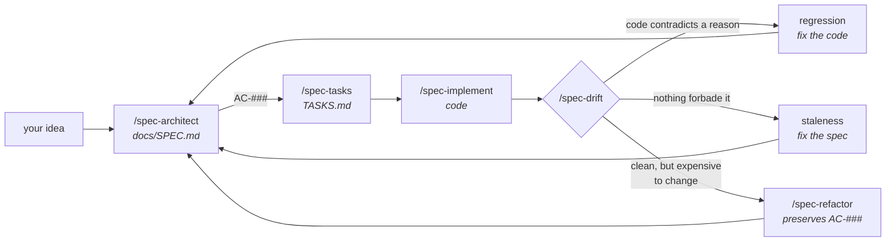

# The loop

One project, six months, six stages. This is the whole workflow.

Everything below is backed by files in [`proof/`](proof/) — `node --test examples/proof/proof.test.mjs`, 17 tests, no dependencies.

---

## Day 1 — `/spec-architect`

```
/spec-architect I want a desktop app for managing employee shifts
```

Four questions. One of them is *"do shifts ever cross midnight?"* — you answer yes, night shifts are normal.

It writes [`docs/SPEC.md`](shift-planner-spec.md). Two lines from it matter for this story:

```
§5   endMinute: number;   // may exceed 1440 for overnight shifts
§8   Overnight shift (22:00 → 06:00) — modeled as a negative duration,
     hour totals and overlap checks both go wrong.
     Handling: endMinute may exceed 1440.
```

That's a decision with a reason attached. It exists because without it, a night shift can't be represented at all.

The same run writes §2.1, where that decision becomes a numbered obligation:

```
AC-003  If two shifts for one employee overlap by any minute, then the
        scheduler shall flag both and refuse to publish.
```

`AC-003` is the identifier every later stage refers to. Nothing else survives the handoff between them.

## Day 2 — `/spec-tasks`, then `/spec-implement`

```
- [ ] T-04 Detect overlaps on a continuous minute timeline — closes AC-003 — files: src/scheduler.js
```

`spec-implement` reads the criterion verbatim before writing the task, runs the constitution's verify command after, and stops at the first one that doesn't hold. Twelve tasks built on a broken task three is the failure it exists to prevent.

## Weeks 1–3 — you build

The code follows the spec. Overnight shifts work. There's a test for it.

```js
test('catches the night shift running into the next morning', () => { … })  ✔
```

## Day 21 — the drift

A session working on form error messages adds input validation:

```js
if (shift.endMinute > 1439) {
  throw new RangeError('endMinute must be between 0 and 1439');
}
```

In isolation this is obviously correct. Minutes in a day run 0–1439. The reviewer agreed. **Every test still passed.**

Nobody re-read §8. It's four pages away, and nothing in this task pointed at it.

**What actually broke:** the manager types a 22:00 → 06:00 shift, gets a validation error on the form, shortens it to 22:00–23:59, and moves on. No warning fires. The overlap with the next morning's shift is never detected — because the night shift was never stored.

Same silence as having no spec at all. Three weeks later.

> Asserted in [`proof.test.mjs`](proof/proof.test.mjs):
> ```
> ✔ still handles ordinary shifts, so nothing looks wrong
> ✔ but the night shift can no longer be saved — §8 is contradicted
> ✔ and the rejection is silent: the overlap is simply never detected
> ```

## Day 24 — `/spec-drift`

```
/spec-drift
```

It reads the spec, reads the code, and compares the claims that are actually checkable:

```
§8 Edge Cases — "endMinute may exceed 1440 for overnight shifts"
   src-core/domain/shift.rs:47   rejects endMinute > 1439

   REGRESSION. The spec recorded why: a 22:00 → 06:00 shift is otherwise
   unrepresentable, and overlap detection silently stops working for it.
   This validation reintroduces exactly the bug the constraint prevented.

   → Fix the code: drop the upper bound on endMinute
   → Or: the requirement changed — update §8 and record what replaced it

§5 Data Models — Employee
   src/db/schema.sql:12   has `phone TEXT NULL`, absent from the spec

   STALE. No decision governs contact details.
   → Add to §5
```

Two gaps, two different verdicts.

The first is a **regression** — the code contradicts a section that recorded a *reason*, so the spec is right and the code broke. The second is **staleness** — nothing forbade it, the document is just behind.

You pick a direction for each. It applies them.

---

## Why the verdict matters more than the finding

The tempting default is to update the spec whenever the two disagree. It's fast and it always resolves the gap.

It's also how a spec ends up documenting its own bugs. Rewrite §8 to say *"endMinute must be 0–1439"* and the night-shift bug is now **the specification**. It will never be found again — not by the next check, not by the next developer, not by the next Claude session reading the file as ground truth.

So the rule is:

> A gap against a section that recorded a *reason* is a regression until proven otherwise.

§3 Decisions, §8 Edge Cases, and §9 Security all carry reasons. Code contradicting one of them almost always means a later session didn't know. Everything else is ordinary staleness — update the document and move on.

---

## Month 6 — `/spec-refactor`

Four features later, drift comes back **clean**. Every criterion holds, the overnight case works, nothing contradicts the spec. And adding the next rule — a minimum rest period between shifts — is four days of work.

```
/spec-refactor
```

`docs/refactorings/0003-m3-rest-period/REPORT.md`:

```
SM-004  Shotgun Surgery — one conflict kind is known in four places
        src/scheduler.js:48, src/export/csv.js:64, src/ui/grid.jsx:99, src/ui/grid.jsx:104
        Blocks: M3 "rest-period rules" (TASKS.md T-04..T-07)

SM-002  Duplicate Code — the same day arithmetic, copied three times,
        and the third copy has already diverged
        src/scheduler.js:26, src/export/csv.js:59, src/ui/grid.jsx:79

- [ ] R-01 Extract the conflict rules into a rule set — removes SM-004 — preserves AC-003 — kind: judgment
- [ ] R-02 Extract `toRange` and delete the two copies — removes SM-002 — preserves AC-003 — kind: mechanical
```

Both lines say **preserves**, not **closes**. That is the difference between this stage and stage 3: a refactoring that needs `AC-003` reworded is not a refactoring, it is a change proposal, and it goes back to `/spec-architect`.

> Asserted in [`proof.test.mjs`](proof/proof.test.mjs) against [`smelly.mjs`](proof/smelly.mjs):
> ```
> ✔ behaves exactly like the spec-derived version — spec-drift finds nothing
> ✔ SM-001 Shotgun Surgery: one rule kind is known in four places
> ✔ SM-002 Duplicate Code: the same day arithmetic, copied three times
> ✔ and the copies have already diverged, in the one path no criterion covers
> ```

The divergence is in the grid tooltip, which no criterion mentions — so an overnight shift displays as `-960` minutes, every test stays green, and stage 5 is right to say nothing. Correctness and changeability are different properties.

---

## The loop



`spec-architect` runs once at the start, then in delta mode for every change after — writing a proposal under `docs/changes/` rather than rewriting the reasoning that made version one correct. `spec-drift` runs whenever you come back: after a milestone, before a new feature, or when you've been away long enough to not trust the document. `spec-refactor` runs when drift is clean and the code is still expensive.

Without the fifth, the first is a document that's correct for about a month. Without the sixth, it stays correct and gets slower to change every milestone.
